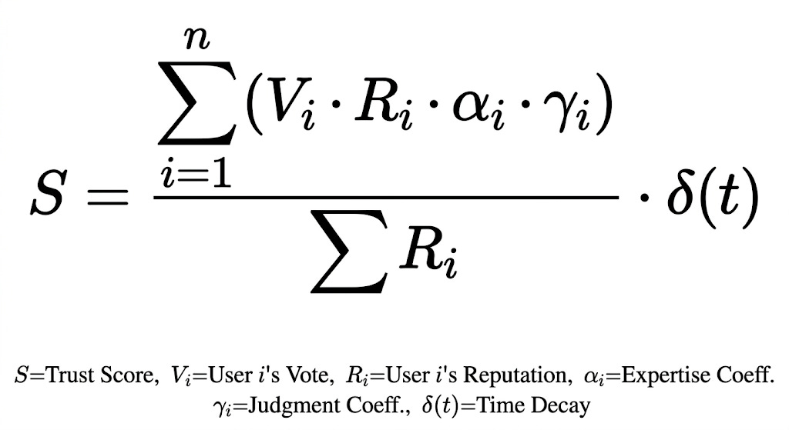

### 知的所有権の活用　（SNSでの記事品質自動評価システム）
--- 
## GitHub版での公開に当たって

本記事で取り上げるアイデアは、権利の譲渡先を note, KADOKAWAに限定するものではありません。
AIを利用し生成したコンテンツの品質向上を目指される、倫理観のある企業様であれば、とくに拘りはございません。
ただし、ベースとなるプラットフォームが　note (https://note.com) を想定しておりますので、noteと資本関係がある企業様の方が好ましいのではないかと考えております。

もし、ご興味がございましたら、ご遠慮なく、下記からご連絡ください。
https://github.com/BANeedKSY/note/discussions

---

Feel free to contact me, if you have any interest about my idea regarding to the  reputation system with AI on SNS platform. 
https://github.com/BANeedKSY/note/discussions

Reference about me (Japanese)
https://github.com/BANeedKSY/note/blob/main/README.md

--- 
### はじめに

私は、noteをBANされた1ユーザー兼株主です。

普通なら、怒り心頭に発して当たり前かもしれません。

BANされる前も、密かにサービスの再生を期待して、さまざまな提案を投稿してきましたが、結局、運営に「聞く耳」はなかったようです。それは一人のユーザーとして、非常に残念なことでした。

私がnoteで提案した中には、特許に値するような知的財産権に関わるアイデアも含まれていました。本当に登録に至るかは未知数ですが、もしこれが形になれば、Substackなどの他SNSとは一線を画し、noteが提携するGoogleとの交渉すら優位に進められる可能性を秘めたものだったのです。

**（Googleの検索AIが渇望している『真の人間による一次情報（Ground Truth）』を抽出するフィルターになると考えております。）**

夢物語だったかもしれませんが、決して冗談でも、大袈裟な話でもなかったつもりです。

……と言っても、この価値がわかる人は、あの中にいたのでしょうか。

_And now, is there anyone who truly understands what I’m saying?_

閑話休題。

---

### 🔷note株式会社向け　再生計画案　(substackでの公開版)

noteで私が提案したものは、基本概念的な表現に留めていました。

substack版では、もう少し進めた、特許明細書のドラフトまでまとめてみました。

> 【書類名】 特許願
> 
> 【発明の名称】 情報信頼性評価システム、情報処理方法、およびプログラム
> 
> 【特許請求の範囲】
> 
> 【請求項１】
> 
> ネットワーク上のプラットフォームにおいてコンテンツの信頼性を評価するシステムであって、
> 
> 前記コンテンツを自動解析する第１評価手段と、
> 
> 複数のユーザーによる前記コンテンツへの評価を受け付ける第２評価手段と、
> 
> 各ユーザーに紐付けられた信頼度（レピュテーション）を保持する信頼度管理手段と、
> 
> 前記第１評価手段の結果と、前記第２評価手段による評価に対し当該評価を行ったユーザーの前記信頼度を乗じた加重値と、に基づき、当該コンテンツの信頼性スコアを算出するスコア算出手段と、
> 
> を備えることを特徴とする情報信頼性評価システム。
> 
> 【請求項２】
> 
> 前記信頼度管理手段は、前記スコア算出手段により算出された信頼性スコアと、各ユーザーが行った前記第２評価の内容との整合性に基づき、各ユーザーの前記信頼度を動的に更新することを特徴とする、請求項１に記載の情報信頼性評価システム。
> 
> 【請求項３】（※キモとなる請求項）
> 
> 前記信頼度管理手段によって更新された各ユーザーの信頼度情報を、当該ユーザー本人に対してのみ限定的に通知または開示するプライベート・フィードバック手段を備え、
> 
> 前記通知または開示により、ユーザー自身の発信および評価行動における自助努力（セルフ・コレクション）を促すことを特徴とする、請求項２に記載の情報信頼性評価システム。
> 
> 【発明の詳細な説明】
> 
> 【技術分野】
> 
> 本発明は、SNSや記事投稿プラットフォームにおいて、生成AI等による低品質な情報の氾濫（AIオンAI汚染）を抑制し、人間による誠実な創作活動を保護するための情報信頼性評価技術に関する。
> 
> 【背景技術】
> 
> 従来のSEO（検索エンジン最適化）や単純な「スキ（Like）」ボタンによる評価システムでは、機械的な大量投稿や、AIボットによる相互評価（サクラ行為）によって、情報の質を問わず露出が操作される課題があった。特に、AIが生成した要約を別のAIが再生産する「情報の自家中毒」は、プラットフォームの資産価値を著しく毀損している。
> 
> 【先行技術文献】
> 
> （※ここに既存のPageRankやSNS評価アルゴリズム等を挙げるが、それらは「排除」や「格付けの公開」を主眼としている点を指摘する）
> 
> 【発明が解決しようとする課題】
> 
> 従来のシステムでは、低品質な発信者を排除することはできても、「無自覚に低品質な情報を拡散している善意のユーザー」を教育・誘導する仕組みが欠如していた。また、評価基準を公開することは、悪意ある業者によるアルゴリズムの逆算（ハック）を招く原因となっていた。
> 
> 【課題を解決するための手段】
> 
> 本発明は、AIによる自動解析と、信頼の蓄積がある「目利き（人間）」の評価を組み合わせる。さらに、算出された個人の信頼度を「自分専用の鏡」としてのみ提示することで、他者との比較や競争ではなく、「コミュニティの基準と自分の行動のズレ」を自覚させ、自発的な行動変容を促すものである。
> 
> 【発明の効果】
> 
> １．ハックの困難化: 信頼スコアが非公開であるため、業者がアルゴリズムを逆算して不正にスコアを上げることが極めて困難になる。
> 
> ２．情報の質的向上: ユーザーが「自分にしか見えないスコア」を指標に、より誠実な発信や評価を行うインセンティブが働く。
> 
> ３．AI汚染の自然淘汰: 信頼ある人間の評価が重く扱われるため、物理的な身体性や実体験を持たないAI生成物の序列が自然に低下する。
> 
> ### 補足資料：信頼性スコアリングの数理モデル（技術付録）
> 
> **（以下、技術的な実装に関心のあるエンジニアや運営担当者のための補足です。数式に馴染みのない方は、読み飛ばしていただいて構いません）**
> 
> 本記事で提言した「読者の審美眼による信頼の重み付け」について、その実装イメージを数理的に補足します。これは単なるアイデアではなく、AIによる情報汚染（AI on AI）を構造的に遮断するためのエンジニアリング・アプローチです。
> 
> #### 1. 基本評価式：信頼性スコアの算出
> 
> 記事または投稿の信頼性スコア _S_ は、以下の加重平均モデルを基本形式として想定します。
> ]
> 
> #### 変数の定義：
> 
> _Vi_: ユーザー _i_ による評価値（「スキ」や多角的な評価指標）
> 
> _Ri_: ユーザー _i_ の現在のレピュテーション（信頼度）
> 
> _αi_: 専門性合致係数（投稿カテゴリーとユーザー _i_ の属性の一致度）
> 
> _γi_: 審美眼補正係数（過去の評価行動の妥当性に基づく重み）
> 
> δ(t): 時間減衰関数（情報の鮮度維持のためのディケイ）
> 
> ---
> 
> #### 2. 本提言の核心：係数設計によるガバナンス
> 
> この数式の「器」自体は統計学における標準的なものですが、システムの命運を握るのは各変数の「**係数（重み）**」の設定です。
> 
> #### ① 非線形な重み付けによるボット対策
> 
> 信頼度 _Ri_ を指数関数的に扱うことで、少数の「信頼ある人間」の評価が、数万の「低スコアなAIボット」によるノイズを圧倒できるように設計します。これにより、数によるハック（サクラ行為）を物理的に無効化します。
> 
> #### ② 「目利き」を優遇するアルゴリズム
> 
> 係数 _γi_ を用いて、まだ注目されていない良質な一次情報（落書き）を早期に見抜いたユーザーの評価権限を動的に高めます。
> 
> #### ③ 自助努力を促す「プライベート・フィードバック」
> 
> **ここが本提案の最も重要な「キモ」です。** 算出された個人の信頼度 _Ri_ の変動は、**本人にのみ限定して通知**されます。
> 
> ユーザーは他者と競うのではなく、自分の「鏡」としてのスコアを通じて、自身の発信や評価行動がコミュニティの信頼性にどう寄与しているかを内省し、自発的に行動を修正（セルフ・コレクション）するよう誘導されます。
> 
> ---
> 
> #### 3. 結論：AIを「道具」に戻すために
> 
> 係数の設計思想は、プラットフォームが「どのような街でありたいか」という意志そのものです。
> 
> 数式で治安を維持し、言葉で魂を吹き込む。AIが生成した無機質な「正解」の山に埋もれる前に、人間の「審美眼」をシステムの中核に再インストールすること。それが、10年来のSEOの歪みと、現在のAI公害に対する解決策です。

### 🔷 補足：このシステムがもたらすビジネス的価値と「再生」のシナリオ

難しい技術や特許の話をしましたが、これらは単なる「空論」ではありません。このシステムが実装されたとき、noteという「街」の価値、そして株主としての私たちの利益はどう変わるのか。3つの決定的なメリットを整理します。

#### 1. Googleという巨人と「対等」に渡り合うための武器

今のインターネットは、AIが書いた「もっともらしい嘘」という泥水で溢れかえっています。Googleですら、どれが「人間の実体験」でどれが「AIの作り話」かを見分けるのに苦労しています。

もしnoteがこの特許を持ち、「信頼できる人間が認めた本物の知恵」だけを抽出できる独占的なフィルター（ザル）を持てば、立場は逆転します。

Googleに「検索順位を上げてください」とお願いする側から、Googleが喉から手が出るほど欲しい**「最高級の食材（信頼された人間のデータ）」**を提供する側へと、交渉の主導権を握ることができるのです。

#### 2. KADOKAWAとの資本提携を「最強」にするエンジン

KADOKAWAとの提携の鍵は「新しい才能の発掘」です。

しかし、AIの量産記事に埋もれた原石を探すのは至難の業。このシステムを導入すれば、KADOKAWAの編集者は「信頼ある目利き（人間）」が認めた「**ノイズのない、本物の才能リスト**」を毎日手に入れることができます。

物語の源泉を守り、ヒット作の打率を劇的に上げる。この「選別眼」こそが、提携の価値を数倍、数十倍に跳ね上げるはずです。

#### 3. 株主価値（株価）を「V字回復」させる新機軸

この特許は、noteを単なる「ブログサイト」から、AI時代の「データの守護神」へと格上げします。

* **新しい収益源（データライセンス）**: AIを開発している巨大企業に対し、「AIが賢くなるための高品質な学習データ」を販売する、全く新しい高利益ビジネスが成立します。

* **管理コストの劇的な削減**: 「鏡（プライベートスコア）」によってユーザーが自ら振る舞いを正す（自浄作用）ようになるため、多額の人件費をかけていた不適切投稿の見回りが不要になります。

***「特許の堀」による株価上昇**: 投資家は「他社に真似できない強み」を高く評価します。この特許がある限り、他のSNSはnoteと同じ「信頼の街」を再現できません。この唯一無二の地位が、株価を根本から押し上げるはずです。

泥船を、世界中のAI企業が燃料（データ）を買いに来る「巨大戦艦」へ。

これこそが、私が描く再生計画の具体的なゴールです。

### 🔷知的財産権および社会実装に関する重要事項

本記事に提示した「信頼性スコアリング・システム」のアイデアは、筆者独自の独創によるものです。

本稿の公開をもって、本アイデアは「公知の情報」となりますが、これは運営による独占や、第三者による悪意ある模倣を防ぐための戦略的公開です。

### note株式会社 経営陣の皆様へ：

特許法第30条（新規性喪失の例外）に基づき、公開から1年以内であれば、依然として特許出願が可能です。もし貴社が、本システムによって「創作の街」の健全化を真摯に目指されるのであれば、然るべき条件（実費負担および誠実な実装の約束等）のもと、特許を受ける権利を貴社へ譲渡する用意があります。

この「鍵」を、誰も使えない正論にするか、街を救うシステムにするか。その決断を貴社に委ねます。

---

# 🔷注意事項

この投稿はSNS用ですので、かなりの落書きが含まれております。

ご注意くださいね。💞

